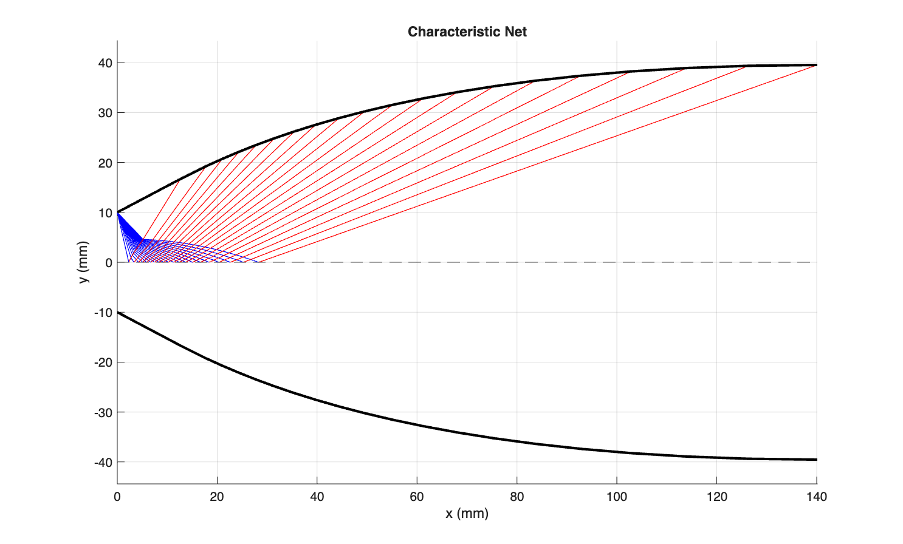
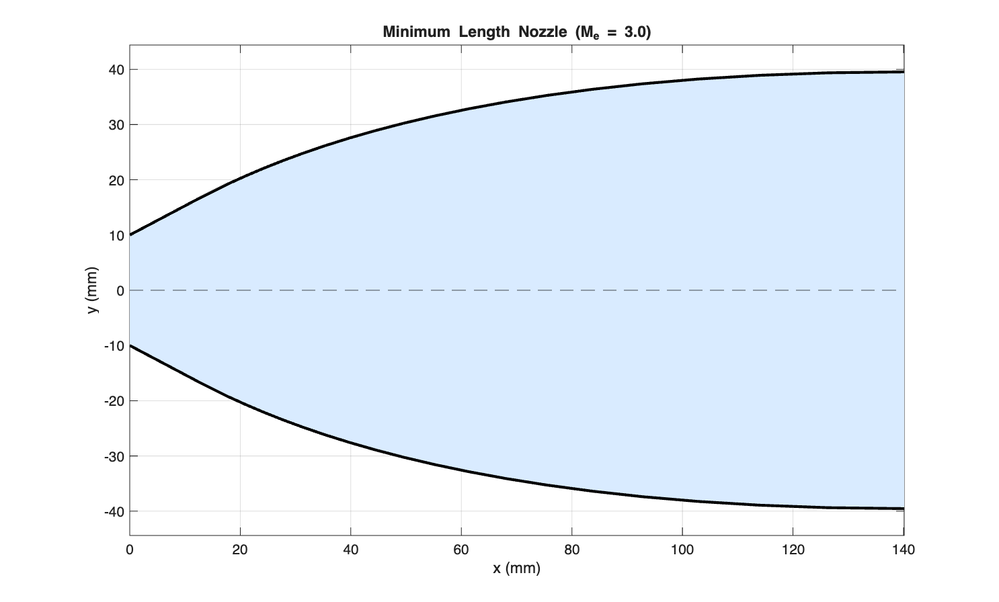

# Minimum-Length Supersonic Nozzle Design using Method of Characteristics (MoC)

[](https://www.mathworks.com/products/matlab.html)
[](LICENSE)
[]()

## Overview
This repository contains a computational fluid dynamics (CFD) implementation in MATLAB to design and analyze a 2D minimum-length supersonic nozzle operating at a design exit Mach number of $M_e = 3.0$. The Method of Characteristics (MoC) is employed to model the steady, inviscid, irrotational, supersonic flow field downstream of a sharp-corner throat.

The algorithm generates the internal characteristic net, solves compatibility relations, applies wall boundary conditions for wave cancellation, and outputs the exact 2D non-linear wall contour required for shock-free, uniform axial exit flow.

---

## Technical Specifications & Assumptions

### Governing Assumptions
* **Flow Conditions:** Steady, 2D, inviscid, irrotational, supersonic flow.
* **Thermodynamic Model:** Calorically perfect gas ($\gamma = 1.3$).
* **Corner Model:** Centered Prandtl–Meyer expansion fan originating from a sharp throat corner.

### Design Input Parameters
| Parameter | Symbol | Value | Unit |
| :--- | :---: | :---: | :---: |
| Specific Heat Ratio | $\gamma$ | 1.3 | - |
| Design Exit Mach Number | $M_e$ | 3.0 | - |
| Throat Height | $h_t$ | 20.0 | mm |
| Expansion Characteristic Lines | $n$ | 20 | lines |

---

## Mathematical Formulation

1. **Prandtl–Meyer Function:**
   $$\nu(M) = \sqrt{\frac{\gamma+1}{\gamma-1}} \arctan\left(\sqrt{\frac{\gamma-1}{\gamma+1}(M^2-1)}\right) - \arctan\left(\sqrt{M^2-1}\right)$$

2. **Riemann Invariants (Compatibility Equations):**
   * Along $C^-$ characteristics ($\frac{dy}{dx} = \tan(\theta - \mu)$):
     $$K^- = \theta + \nu = \text{constant}$$
   * Along $C^+$ characteristics ($\frac{dy}{dx} = \tan(\theta + \mu)$):
     $$K^+ = \theta - \nu = \text{constant}$$

3. **Max Wall Angle (Minimum Length Criterion):**
   $$\theta_{\max} = \frac{\nu_e}{2}$$

---

## Results & Performance Summary

| Computed Metric | Symbol | Value | Unit |
| :--- | :---: | :---: | :---: |
| **Exit Prandtl–Meyer Angle** | $\nu_e$ | 55.7584 | deg |
| **Max Wall Contour Angle** | $\theta_{\max}$ | 27.8792 | deg |
| **Total Nozzle Length** | $L$ | 140.1246 | mm |
| **Exit Full Height** | $h_e$ | 79.0672 | mm |
| **Geometric Area Ratio** | $A_e/A^*$ | 3.95336 | - |
| **Isentropic 1D Area Ratio** | $A_e/A^*$ | 5.15977 | - |
| **Total Mesh Grid Nodes** | $N_{tot}$ | 230 | points |

---

## Output Visualizations

### 1. Characteristic Net
Shows the complete mesh of $C^-$ (blue) and $C^+$ (red) characteristic wave intersections and wall reflections.



### 2. Nozzle Contour
Displays the resulting non-linear 2D minimum-length nozzle geometry designed for uniform exit flow.



---

## File Structure

```text
.
├── minimum_length_nozzle_MOC.m   # Main MATLAB script for computation and plotting
├── wall_table.csv                # Exported CSV containing wall node coordinates (x, y, theta, Mach)
├── characteristic_net.png        # Plot of internal wave characteristics
├── nozzle_contour.png            # Plot of the full nozzle profile
└── README.md                     # Project documentation
